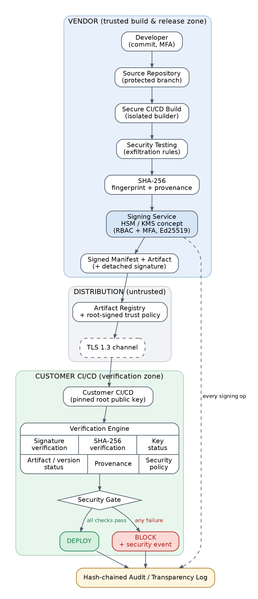
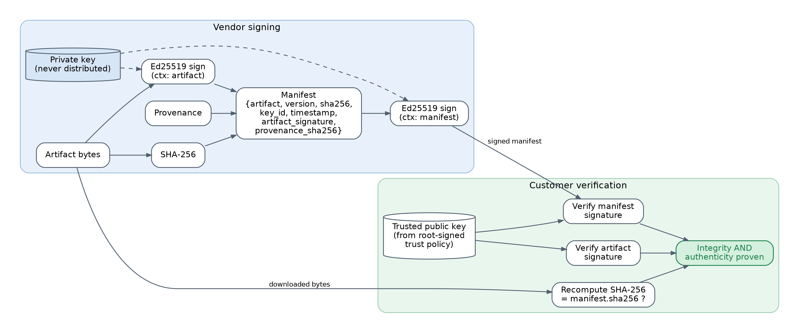
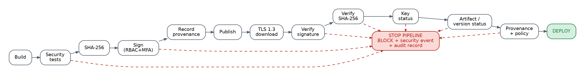
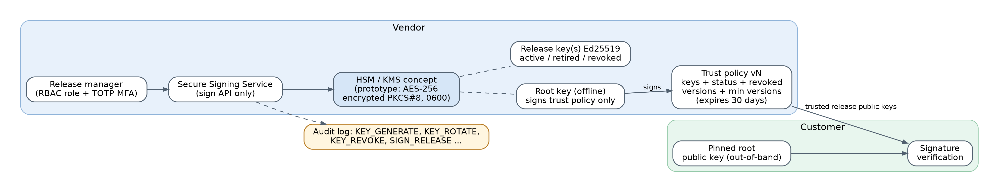

# Design & Implementation — Cryptographically Verified Software Supply Chain

> Preventing Codecov-style supply-chain attacks (INS / BCS701 CCA)

This document is the "before coding" design required by the project brief
(architecture, components, data flow, threat model, cryptographic design, key
management, database schema, API design, folder structure, implementation
plan) followed by limitations and future work. Diagrams are in
[`docs/diagrams/`](diagrams/) and measured results in [`docs/results/`](results/).

---

## 0. Documented incident vs. proposed solution

| Documented facts (Codecov, 2021) | Proposed student solution (this project) |
|---|---|
| From 31 Jan 2021 an unauthorised party periodically altered Codecov's Bash Uploader script. | Every release is signed; any alteration after signing fails verification. |
| Access came from an error in Codecov's Docker image creation process that let the actor extract a credential (an HMAC key for a Google Cloud Storage service account) able to modify the script. | Possession of a storage credential is not enough: customers accept only artifacts signed by a key held in the signing service (RBAC + MFA, HSM/KMS in production). |
| The modified script sent `git remote -v` output and all environment variables from customers' CI to a third-party server. | Vendor build and customer gate both scan for this exfiltration pattern; the gate blocks deployment. |
| The script was served from Codecov's genuine domain over HTTPS. | TLS 1.3 is used for transport **and** signatures are verified, because TLS cannot tell a malicious file from a genuine one. |
| Detected on 1 Apr 2021 when a customer noticed the checksum of the downloaded script differed from the published one; disclosed 15 Apr 2021. | Verification is automatic, mandatory and cryptographic in every customer pipeline, not dependent on one customer checking by hand. |

---

## 1. Complete architecture



Three trust zones:

* **Vendor (trusted)** – source repo, isolated builder, security tests,
  signing service, key store (HSM/KMS concept), audit log.
* **Distribution (untrusted)** – artifact registry and the network. Assumed
  compromisable; it carries signed data only.
* **Customer (verification)** – CI/CD pipeline with a pinned root public key,
  verification engine and security gate.

## 2. Component responsibilities

| Component | File | Responsibility | Security reason |
|---|---|---|---|
| Secure build | `vendor/build.py` | Runs security tests, packages the artifact, computes SHA-256, records provenance | Malicious code never gets signed; provenance binds artifact to source/builder |
| Security rules | `common/security_rules.py` | Detects Codecov-style exfiltration (`$(env)`, `git remote -v`, `curl -d $(..)`, raw IPs, `curl \| sh`) | Preventive (vendor) and detective (customer) control |
| Access control | `vendor/access_control.py` | RBAC roles + TOTP (RFC 6238) MFA | A stolen password/token alone cannot obtain a signature |
| Signing service | `vendor/sign.py` | Only component that loads private keys; produces artifact + manifest signatures | Mirrors an HSM/KMS `Sign` API; keys never leave |
| Key manager | `vendor/key_manager.py` | Key generation, encrypted storage, rotation, revocation, root-signed trust policy | Limits the damage and lifetime of a key compromise |
| TLS registry | `distribution/tls_registry.py` | HTTPS registry, TLS 1.3 only, local CA | Channel confidentiality/integrity, blocks network MITM & downgrade |
| Manifest | `verifier/manifest.py` | Schema validation of the signed manifest | Rejects malformed / incomplete metadata |
| Policies | `verifier/policy.py` | Trust-policy verification (root sig, expiry, anti-rollback) + customer policy | Trust decisions come from the pinned root key, not the registry |
| Verifier | `verifier/verify.py` | 10 independent checks, full report | Integrity **and** authenticity **and** authorisation |
| Security gate | `ci/security_gate.py` | DEPLOY or BLOCK, security events, continuous pipeline | Enforcement is automatic, not advisory |
| Audit log | `audit/audit_logger.py` | SQLite, hash-chained | Tamper-evident record of every signature and decision |
| Dashboard | `dashboard/generate_dashboard.py` | HTML view of decisions, events, chain integrity | Visibility for operators / auditors |
| Attack simulation | `attack_simulation/*` | Safe local reproduction of each attack | Demonstrates each control |

## 3. Data flow



1. Developer commits → builder runs security tests on the source.
2. Builder writes `secure-uploader-<v>.sh`, computes SHA-256, creates provenance.
3. Release manager (role + MFA) asks the signing service to sign.
4. Signing service: `artifact_signature = Ed25519(sk, "SSCS-v1/artifact\n" || bytes)`;
   builds the manifest; `signature = Ed25519(sk, "SSCS-v1/manifest\n" || canonical_json(manifest))`.
5. Artifact + manifest are published to the registry; the root-signed trust policy sits next to them.
6. Customer CI downloads all three over TLS 1.3.
7. Verification engine runs every check; gate deploys or blocks; everything is logged.

## 4. Threat model (STRIDE)



| # | Asset | Threat (STRIDE) | Attack | Vulnerability | Security control | Expected result |
|---|---|---|---|---|---|---|
| T1 | Released artifact | Tampering | Modify the script in storage (Codecov) | Storage credential sufficient to change a release | SHA-256 in signed manifest + Ed25519 artifact signature | HASH_MISMATCH / INVALID_SIGNATURE → BLOCK |
| T2 | Build server | Tampering / Elevation | Inject code during build | Build not isolated, output not checked | Security tests before signing, provenance (builder ID, build ID, source hash) | Build stopped; unapproved builder → INVALID_PROVENANCE |
| T3 | Artifact repository | Tampering | Replace artifact **and** checksum file | Checksum published beside the artifact | Checksum inside a signed manifest; customer trusts only keys from the root-signed trust policy | INVALID_SIGNATURE → BLOCK |
| T4 | Signing key | Information disclosure → Spoofing | Steal private key | Key stored in plain file / CI secret | Encrypted key store (HSM/KMS in production), MFA-gated signing, audit log, revocation, customer content scan | POLICY_VIOLATION, then REVOKED → BLOCK |
| T5 | Signer identity | Spoofing | Sign with own key / claim vendor key ID | Customer accepts any signature | Keys only from trust policy; signature verified against that key | UNAUTHORIZED_KEY / INVALID_SIGNATURE |
| T6 | Download channel | Tampering / Info disclosure | Man-in-the-middle, TLS downgrade | Plain HTTP or legacy TLS | TLS 1.3 only, CA-validated certificate; signatures independent of channel | Handshake refused; any change still caught by signature |
| T7 | Customer deployment | Tampering (replay) | Serve an old, vulnerable but validly signed version | No version policy | Revoked-versions list, minimum version, anti-rollback state, equivocation check | REVOKED / REPLAY_BLOCKED |
| T8 | Manifest | Tampering | Edit hash, version, provenance | Unsigned metadata | Manifest signature covers every field incl. provenance | INVALID_SIGNATURE |
| T9 | Trust policy | Tampering / Spoofing | Add attacker key, un-revoke key, replay old policy | Registry controls trust data | Root signature, pinned root key, expiry (30 days), monotonic version | INVALID_TRUST_POLICY |
| T10 | CI/CD credentials | Elevation of privilege | Use leaked token to sign releases | Signing needs only a token | RBAC role + TOTP MFA per signing request | UNAUTHORIZED_SIGNER, logged |
| T11 | Audit evidence | Repudiation | Delete or edit log rows to hide a rogue signing | Mutable logs | SHA-256 hash chain over all rows | Chain BROKEN detected |
| T12 | Pipeline availability | Denial of service | Flood registry / break verification | – | Out of scope; fail-closed gate (blocks rather than deploys unverified code) | Safe failure |

## 5. Cryptographic design

| Primitive | Where | Purpose | Why this choice |
|---|---|---|---|
| **SHA-256** (FIPS 180-4) | artifact digest, provenance digest, audit hash chain | Integrity fingerprint | Collision-resistant, universal tooling. *Not* authentication: anyone can compute a hash. |
| **Ed25519** (RFC 8032, FIPS 186-5) | artifact signature, manifest signature, trust-policy signature | Authenticity + integrity + non-repudiation | Fast, deterministic (no RNG failure at sign time), small 32-byte keys / 64-byte signatures, resistant to many implementation pitfalls of ECDSA. RSA-PSS-3072 would be an acceptable alternative. |
| **Domain separation** | prefixes `SSCS-v1/artifact`, `/manifest`, `/trust-policy` | Prevents cross-protocol signature reuse | A manifest signature can never be replayed as an artifact or policy signature |
| **Canonical JSON** | manifest, trust policy, provenance | Deterministic bytes to sign | Same data → same signature input on every platform |
| **TLS 1.3** (RFC 8446), ECDHE + AEAD (e.g. `TLS_AES_256_GCM_SHA384`) | registry download | Channel confidentiality, integrity, server authentication, forward secrecy | Removes legacy ciphers and downgrade paths |
| **PKI / pinned root key** | customer trust anchor | Establishes which release keys to trust | Two-tier (root → release keys) as in TUF |
| **AES-256 (PKCS#8 encryption)** | private keys at rest (prototype) | Key confidentiality | Stand-in for HSM/KMS non-exportable keys |
| **HMAC-SHA1 TOTP** (RFC 6238) | MFA for signing | Second factor | Standard authenticator-app algorithm |

What we deliberately do **not** claim: hashing does not authenticate; TLS does
not prove a vendor artifact is benign; encrypting an artifact would not prove
who produced it. AES is used only where confidentiality is needed (key storage).

## 6. Key-management design



| Function | Implementation |
|---|---|
| Generation | `Ed25519PrivateKey.generate()` (OS CSPRNG); key ID = `ed25519:` + first 16 hex of SHA-256(raw public key) |
| Private-key protection | PKCS#8 encrypted with passphrase (`SSCS_KEY_PASSPHRASE`), file created 0600; loaded only inside the signing service; production: HSM / cloud KMS, non-exportable |
| Public-key distribution | Release public keys published in the **root-signed trust policy**; root public key pinned by the customer out-of-band |
| Key identifiers | Carried in manifest + signature envelope; must match the trust policy |
| Rotation | `rotate()` – old key → *retired* (still verifies releases signed before `retired_at`), new key → *active*; new policy published |
| Revocation | `revoke()` – key → *revoked*, private key file destroyed, new key generated; every artifact signed with it is rejected |
| Old-key invalidation | Retired keys cannot validate releases time-stamped after retirement; policy can disable retired keys entirely |
| Artifact revocation | Revoked-version list and minimum version per artifact in the trust policy |
| Audit logging | ROOT_KEY_CREATE, KEY_GENERATE, KEY_ROTATE, KEY_REVOKE, TRUST_POLICY_PUBLISH, SIGN_RELEASE (incl. denied attempts) |

## 7. Database schema (SQLite `audit/audit.db`)

```sql
CREATE TABLE audit_events (
  id INTEGER PRIMARY KEY AUTOINCREMENT,
  timestamp TEXT NOT NULL, actor TEXT NOT NULL, action TEXT NOT NULL,
  artifact TEXT, version TEXT, sha256 TEXT, key_id TEXT,
  result TEXT NOT NULL,        -- PASS | BLOCKED | REVOKED | HASH_MISMATCH | INVALID_SIGNATURE | UNAUTHORIZED_KEY ...
  reason TEXT, details TEXT,
  prev_hash TEXT NOT NULL,     -- entry_hash of previous row (genesis = 64 zeros)
  entry_hash TEXT NOT NULL UNIQUE  -- SHA-256(prev_hash || canonical_json(row))
);
```

Statuses: `PASS, BLOCKED, REVOKED, HASH_MISMATCH, INVALID_SIGNATURE,
UNAUTHORIZED_KEY, UNAUTHORIZED_SIGNER, REPLAY_BLOCKED, INVALID_MANIFEST,
INVALID_PROVENANCE, INVALID_TRUST_POLICY, POLICY_VIOLATION`.

## 8. API design (Python modules + CLI)

| API | CLI | Returns |
|---|---|---|
| `KeyManager(ws).init() / rotate() / revoke(kid, reason) / revoke_artifact(a, v, reason) / set_minimum_version(a, v)` | `python -m vendor.key_manager init\|list\|rotate\|revoke\|revoke-artifact\|min-version` | key IDs, signed trust policy |
| `build(ws, version)` | `python -m vendor.build --version 1.0.0` | `BuildResult(artifact_path, sha256, provenance)` |
| `SigningService(ws).sign_release(user, otp, artifact_path, version, provenance)` | `python -m vendor.sign --version 1.0.0 --user alice` | manifest path, or `AccessDenied` |
| `RegistryServer(ws)`, `fetch(ws, url, name)` | `python -m distribution.tls_registry serve\|fetch` | TLS version, cipher, file |
| `Verifier(ws).verify(artifact, manifest)` | `python -m verifier.verify --artifact A --manifest M` | `VerificationResult` (status, checks, timings) |
| `SecurityGate(ws).evaluate(artifact, manifest)` | `python -m ci.security_gate verify ...` (exit 0/1) | `GateDecision(DEPLOY\|BLOCK, result, security_event)` |
| `run_pipeline(ws, version, attack=None)` | `python -m ci.security_gate pipeline --version 1.0.0` | stage-by-stage report |
| `AuditLog(db).log(...) / verify_chain()` | `python -m audit.audit_logger` | rows, chain integrity |

## 9. Project folder structure

```
secure-supply-chain/
├── vendor/            build.py, sign.py (signing service), key_manager.py, access_control.py
├── verifier/          verify.py, manifest.py, policy.py
├── distribution/      tls_registry.py (TLS 1.3 registry + client)
├── ci/                security_gate.py (gate + continuous pipeline)
├── audit/             audit_logger.py (hash-chained SQLite log)
├── attack_simulation/ tamper.py, revoked_key_test.py, run_all.py
├── dashboard/         generate_dashboard.py -> index.html
├── common/            crypto_utils.py, security_rules.py, workspace.py, console.py
├── policy/            customer_security_policy.json
├── src_app/           secure-uploader.sh (simulated uploader, the protected artifact)
├── tests/             test_supply_chain.py (25 tests), generate_test_report.py
├── docs/              DESIGN.md, diagrams/, results/
├── bootstrap.py       one-time key/user/TLS setup
├── demo.py            5-minute live demo
└── README.md
```

Runtime directories (`workspace/`, `demo_workspace/`: keys, artifacts,
registry, customer, audit) are generated and git-ignored — private keys are
never committed.

## 10. Step-by-step implementation plan (as built)

| Step | What it does | Security reason | Run | Test |
|---|---|---|---|---|
| 1 | `common/crypto_utils.py` – SHA-256, Ed25519 sign/verify with domain separation, canonical JSON | Correct, reusable primitives | – | all tests |
| 2 | `vendor/key_manager.py` + `bootstrap.py` – root + release keys, trust policy | Root of trust, key lifecycle | `python bootstrap.py --reset` | TC04, TC05, TC09, TC11 |
| 3 | `vendor/access_control.py` – RBAC + TOTP | No signature without role + MFA | `python -m vendor.access_control otp alice` | TC08 |
| 4 | `vendor/build.py` – security tests + provenance | Malicious code never signed | `python -m vendor.build --version 1.0.0` | TC08b |
| 5 | `vendor/sign.py` – signing service, manifest, publish | Authenticity + integrity bound together | `python -m vendor.sign --version 1.0.0` | TC01 |
| 6 | `verifier/*` – 10-check verification engine | Customer proves integrity **and** authenticity | `python -m verifier.verify --artifact .. --manifest ..` | TC02–TC07d |
| 7 | `distribution/tls_registry.py` – TLS 1.3 registry | Channel protection | `python -m distribution.tls_registry serve` | TC12, TC13 |
| 8 | `ci/security_gate.py` – gate + continuous pipeline | Automatic DEPLOY/BLOCK | `python -m ci.security_gate pipeline --version 1.0.0` | TC13, TC14 |
| 9 | `audit/audit_logger.py` + dashboard | Tamper-evident accountability | `python -m audit.audit_logger` | TC10 |
| 10 | `attack_simulation/*`, `demo.py` | Show the attack and the defence | `python -m attack_simulation.run_all`, `python demo.py` | 14 scenarios |

Expected output of each step is shown in the README and in `demo.py`.

## 11. Limitations

* **Stolen but valid signing key**: until revocation is published, a thief can
  produce valid signatures. Mitigated (not eliminated) by MFA-gated signing,
  HSM/KMS, audit-log monitoring, the customer-side content scan and fast
  revocation. Pattern scanning can be evaded by obfuscation.
* **Compromised source before build**: signatures prove *who* built an
  artifact, not that the source is benign. Code review, branch protection and
  the security tests reduce this risk.
* **Trust bootstrap**: the root public key must reach customers through an
  authentic channel (package manager, onboarding docs, fingerprint check).
* **Prototype key storage**: software key store with a passphrase, not an HSM.
* **Transparency**: the audit log is vendor-local; a public append-only log
  (Rekor / RFC 6962-style Merkle tree) would let third parties monitor signing.
* **Single-signer**: production releases would benefit from threshold (m-of-n) signing.
* **Clock trust**: expiry and key-retirement checks rely on reasonably correct clocks.

## 12. Future work

* Sigstore/cosign keyless signing with OIDC identities and Rekor transparency log.
* in-toto layouts / SLSA Level 3 provenance generated by a hosted builder.
* Threshold signatures (2-of-3 release managers) for production releases.
* SBOM (CycloneDX/SPDX) signing and dependency vulnerability gating.
* Cloud KMS / HSM backend behind the same `SigningService` interface.
* GitHub Action / GitLab component packaging of the gate for customers.
