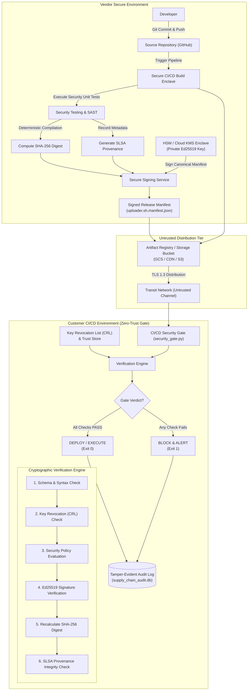
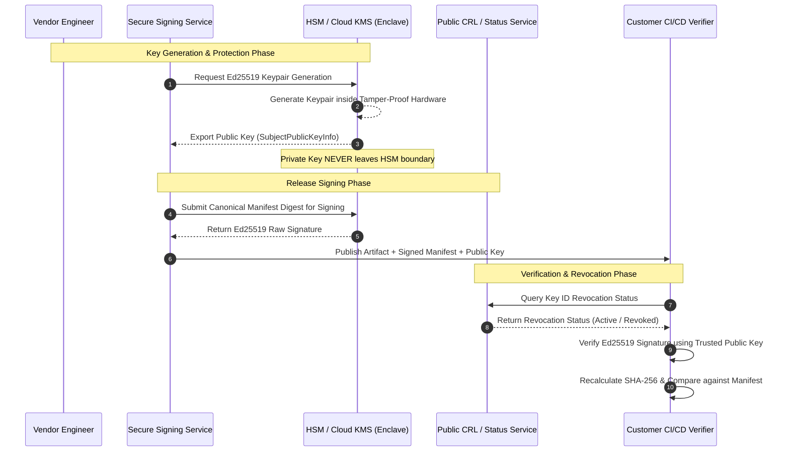

# Security Architecture & Data Flow Specification
## Cryptographically Verified Software Supply Chain

### 1. High-Level Architecture Diagram

---

### 2. Key Management Architecture (HSM / KMS Concept)

---

### 3. Component Responsibilities

1. **Vendor Build Engine (`vendor/build.py`)**:
   - Compiles or packages software artifacts deterministically.
   - Computes canonical SHA-256 hash across raw artifact bytes.
   - Generates structured SLSA Level 2+ provenance documentation linking commit hash, build worker identity, build timestamp, and dependency hashes.

2. **Vendor Key Manager (`vendor/key_manager.py`)**:
   - Manages Ed25519 elliptic curve key pairs.
   - Enforces key encapsulation and PKCS#8 encrypted serialization.
   - Issues and manages the Key Revocation List (CRL) for instant emergency revocation.
   - Coordinates cryptographic key rotation.

3. **Vendor Signing Engine (`vendor/sign.py`)**:
   - Converts release manifests into deterministic RFC 8785 canonical JSON bytes.
   - Validates that signing keys are in active (non-revoked) status before signing.
   - Signs the canonical payload using Ed25519 private key.
   - Emits signed release bundles and records operations to the audit database.

4. **Customer Admission Policy (`verifier/policy.py`)**:
   - Implements zero-trust security constraints.
   - Pins allowed signers, trusted key IDs, and authorized source code repositories.
   - Enforces version monotonicity and rejects deprecated or vulnerable releases.

5. **Customer Verification Engine (`verifier/verify.py`)**:
   - Parses and validates signed manifests against schema.
   - Queries CRL to verify signing key validity.
   - Verifies Ed25519 asymmetric signature using vendor's public key.
   - Recalculates SHA-256 digest on local download and asserts byte-level equivalence.
   - Verifies build provenance metadata.

6. **CI/CD Security Gate (`ci/security_gate.py`)**:
   - Plugs directly into customer pipelines (e.g. Jenkins, GitHub Actions, GitLab CI).
   - Serves as the binary decision enforcement point: returns `0` (allow) or `1` (abort).

7. **Tamper-Evident Audit Logger (`audit/audit_logger.py`)**:
   - Records all signing, verification, pass, and block events in SQLite.
   - Captures timestamp, artifact, version, sha256, key_id, verification_result, process, action, rejection_reason.

8. **Web Observability Dashboard (`dashboard/app.py`)**:
   - Provides real-time visibility into pipeline security telemetry, blocked attacks, and CRL status.
